### 实验三 数据查询4学时.

#### 【实验教学的目的】

1.简单查询、带条件查询。

2.聚合函数、分组查询

#### 【实验原理】

基本查询和统计查询都要用到select语句，但根据不同的查询要求，会使用不同的关键字或集合函数。

SELECT语句的基本语法格式如下：

```
SELECT [ALL|DISTINCT] 字段名1,字段名2…|*
FROM 表名列表  
[WHERE 条件表达式1]  
[GROUP BY 字段名]
[HAVING 条件表达式2]
[ORDER BY 列名 [ASC|DESC]]
LIMIT [OFFSET,] n;
```

#### 【实验内容】

**题目1：在网上书店数据库中进行简单查询**

1. 查询会员表，输出积分高于500的会员昵称和联系电话

   ```sql
   use bookstore;
   SELECT uname, tnum
   FROM user
   WHERE score > 500;
   ```

​	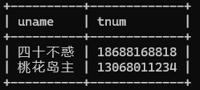

2.  查询会员表，输出积分低于200的会员的昵称和联系电话，并且分别用英文username、telephone指定别名

   ```sql
   SELECT uname username, tnum telephone
   FROM user
   WHERE score < 200;
   ```

​	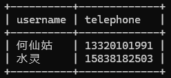

3. 查询会员表，输出e-mail是QQ邮箱的会员的昵称和e-mail

   ```sql
   SELECT uname, email
   FROM user
   WHERE email LIKE '%@qq.com';
   ```

   

​	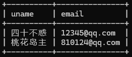

4. 查询订购表，输出订购日期是2016年10月的订单的详细信息

   ```sql
   SELECT *
   FROM b_order
   WHERE orderdate BETWEEN '2016-10-01' AND '2016-10-31';
   ```

​	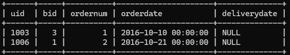

5. 查询订购表，输出订货的会员的编号，要求删除重复行

   ```sql
   SELECT DISTINCT uid
   FROM b_order;
   ```

​	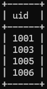

6. 查询图书表，输出图书的名称和价格，并把查询结果按价格降序排列

   ```sql
   SELECT bname, price
   FROM book
   ORDER BY price DESC;
   ```

​	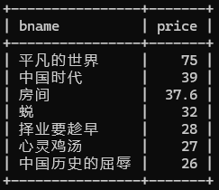

7. 查询图书表，输出价格最高的三种图书的名称和价格

   ```sql
   SELECT bname, price
   FROM book
   ORDER BY price DESC
   LIMIT 3;
   ```

​	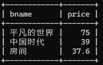

8. 查询图书表，输出价格\>30的书籍的名称和作者

   ```sql
   SELECT bname, author
   FROM book
   WHERE price > 30;
   ```

   ​	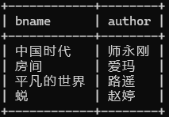

9. 查询图书表，输出以中国开头的图书的名称，作者及出版社

   ```sql
   SELECT bname, author, publisher
   FROM book
   WHERE bname LIKE '中国%';
   ```

​	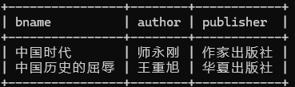

**题目2：在网上书店数据库查询中使用集合函数**

1. 查询图书表，输出所有图书的最高价格，最低价格，平均价格

   ```sql
   SELECT MAX(price) max_price, MIN(price) min_price, AVG(price) avg_price
   FROM book;
   ```

​	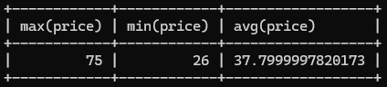

2. 查询图书表，输出每一类图书的数量

   ```sql
   SELECT cid, COUNT(*) AS count
   FROM book
   GROUP BY cid;
   ```

​	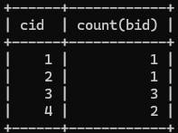

3. 查询图书表，输出每一类图书的最高价格，最低价格，平均价格

   ```sql
   SELECT cid, MAX(price) max_price, MIN(price) min_price, AVG(price) avg_price
   FROM book
   GROUP BY cid;
   ```

​	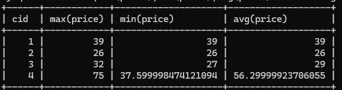

4. 查询订购表，输出订购超过3本的会员的编号和订购数量

   ```sql
   SELECT uid, SUM(ordernum) total_books
   FROM b_order
   GROUP BY uid
   HAVING total_books > 3;
   ```

​	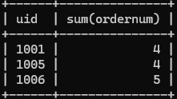

#### 【主要实验仪器及设备】

计算机、MySQL
