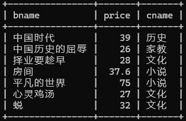
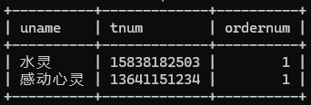
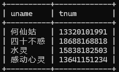
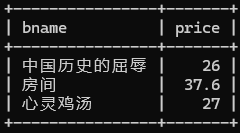
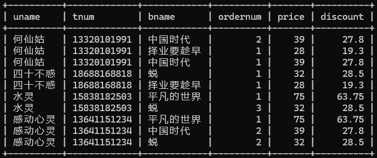
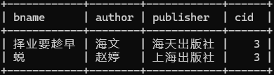

# 实验三 数据查询

### 【实验教学的目的】

连接查询、子查询

### 【实验原理】

连接查询是关系数据库中最重要的查询，通过连接可以实现多表查询。连接查询主要分为内连接、外连接和交叉连接。其中内连接分为等值连接、非等值连接、自然连接和自连接。

所谓子查询，就是指在一个查询里嵌套了其他的若干查询，即在一个SELECT语句的WHERE或HAVING或FROM子句中包含另一个SELECT查询语句。

连接查询语句的基本语法格式如下：

1. 内连接

   ```
   SELECT [ALL|DISTINCT] 字段列表  
   FROM 表名1 [INNER] JOIN 表名2 ON 连接条件
   ```

2. 外连接

   ```
   SELECT [ALL|DISTINCT] 字段列表  
   FROM 表名1 LEFT|RIGHT|FULL [OUTER] JOIN 表名2 ON 连接条件
   ```

   

### 【实验内容】

**题目3：在网上书店数据库查询中使用连接查询和子查询**

1. 输出所有图书的图书名称、价格以及所属类别名称

   ```sql
   SELECT b.bname, b.price, c.cname
   FROM book b, category c
   WHERE b.cid = c.cid;
   ```

   

2. 输出订购了“平凡的世界”的会员昵称、联系电话、订购数量

   ```sql
   SELECT DISTINCT u.uname, u.tnum, o.ordernum
   FROM user u, b_order o, book b
   WHERE u.uid = o.uid AND o.bid = b.bid AND b.bname = '平凡的世界';
   ```

   

3. 输出订购了图书的会员的昵称和联系电话

   ```sql
   SELECT DISTINCT u.uname, u.tnum
   FROM user u, b_order o
   WHERE u.uid = o.uid;
   ```

   

4. 输出没人订购的图书的名称和价格

   ```sql
   SELECT b.bname, b.price
   FROM book b
   WHERE b.bid NOT IN (SELECT bid FROM b_order);
   ```

   

5. 输出详细订购信息，包括订购图书的会员呢称，联系电话，所订图书名称，数量，价格，折扣价

   ```sql
   SELECT u.uname, u.tnum, b.bname, o.ordernum, b.price, b.discount
   FROM user u, b_order o, book b
   WHERE u.uid = o.uid AND o.bid = b.bid;
   ```

   

6. 输出与“心灵鸡汤”属于同一个类别的其他书籍的图书名称、作者、出版社及图书类别

   ```sql
   SELECT b.bname, b.author, b.publisher, c.cname
   FROM book b, category c
   WHERE b.cid = c.cid
   AND b.cid = (SELECT cid FROM book WHERE bname = '心灵鸡汤')
   AND b.bname != '心灵鸡汤';
   ```

   

### 【主要实验仪器及设备】

计算机、MySQL
