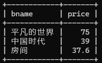

# 实验五 视图与索引（2学时）

### 【实验教学的目的】

1. 掌握创建和查看视图。

2. 掌握修改视图、更新视图。

3. 掌握索引的创建与管理

### 【实验原理】

创建视图的语法如下：

```
CREATE VIEW 视图名[(列名[,…n])]
AS
查询语句
[WITH LOCAL | CASCADED CHECK OPTION]
```

其中，视图名再数据库中必须唯一，不能出现重名。(列名[,…n])为可选项，在定义视图时需指定视图的全部列名，或全部省略不写，不支持指定部分列名。如果省略了列名部分，则视图的列名与查询语句中查询结果显示的列名相同。

创建索引的语法如下：

```
CREATE TABLE 表名
(字段名 数据类型[完整性约束条件],
...
UNIQUE|FULLTEXT|SPATIAL] INDEX|KEY [别名](字段名[(长度)]) [ASC|DESC]);
```

参数说明：

- UNIQUE: 该选项表示创建唯一索引，在索引列中不能有相同的列值存在。

- FULLTEXT: 该选项表示创建全文索引。

- SPATIAL： 该选项表示创建空间索引。

【实验内容】

**题目1：在“网上书店”数据库中创建视图并维护使用**

1. 定义基于图书表的视图book_view（包含图书编号、图书名称、作者、价格、出版社、图书类别）

   ```sql
   CREATE VIEW book_view AS
   SELECT bid, bname, author, price, publisher, cid
   FROM book;
   ```


2. 查询图书表视图，输出图书的名称和价格，并把查询结果按价格降序排列

   ```sql
   SELECT bname, price
   FROM book_view
   ORDER BY price DESC;
   ```


3. 查询图书表视图，输出价格最高的三种图书的名称和价格

   ```sql
   SELECT bname, price 
   FROM book_view 
   ORDER BY price DESC 
   LIMIT 3;
   ```



**题目2：在“网上书店”数据库中创建视图并维护使用**

4. 定义视图user_border_book_view。包含（会员编号、会员昵称、积分、书籍的名称）

   ```sql
   CREATE VIEW user_border_book_view AS
   SELECT u.uid 会员编号, u.uname 会员昵称, u.score 积分, b.bname 书籍名称
   FROM user u, b_order bo, book b
   WHERE u.uid = bo.uid AND bo.bid = b.bid;
   ```


5. 查询视图user_border_book_view，输出会员编号为'1001'的用户所购买的书籍名称

   ```sql
   SELECT 书籍名称
   FROM user_border_book_view
   WHERE 会员编号 = '1001';
   ```


6. 查询视图user_border_book_view，输出积分>150的会员昵称及积分

   ```sql
   SELECT DISTINCT 会员昵称, 积分
   FROM user_border_book_view
   WHERE 积分 > 150;
   ```


7. 修改视图user_border_book_view中，会员编号为'1005'的会员昵称为'圣诞老人'

   ```sql
   UPDATE user_border_book_view
   SET 会员昵称 = '圣诞老人'
   WHERE 会员编号 = '1005';
   ```


**题目3：在“网上书店”数据库中创建索引并查看维护**

8. 在会员表的联系方式（即联系电话）列上定义唯一索引idx_tnum，并查看会员表中的所有索引

   ```sql
   ALTER TABLE user ADD UNIQUE INDEX idx_tnum (tnum);
   SHOW INDEX FROM user;
   ```


9. 在图书表的图书名称列上定义普通索引idx_bname，并查看图书表中的所有索引。

   ```sql
   ALTER TABLE book ADD INDEX idx_bname (bname);
   SHOW INDEX FROM book;
   ```


10. 删除以上所创建的索引idx_tnum，idx_bname

    ```sql
    ALTER TABLE user DROP INDEX idx_tnum;
    ALTER TABLE book DROP INDEX idx_bname;
    ```

【主要实验仪器及设备】

计算机、MySQL
