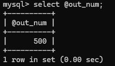

# 实验六 存储过程与游标

### 【实验教学的目的】

掌握创建存储过程和存储过程中变量的使用。

### 【实验原理】

编写存储过程和存储函数时，可以使用流程控制语句对SQL语句进行组织，使其成为符合业务逻辑的代码块。MySQL中常见的流程控制语句主要有：IF语句、CASE语句、LOOP语句、WHILE语句、ITERATE语句、REPEAT语句等。

### 【实验内容】

**题目1：在网上书店数据库中创建存储过程**

1. 在网上书店数据库中创建一个名为proc_1的存储过程，实现查询所有会员信息的功能。

   ```sql
   DELIMITER $$
   CREATE PROCEDURE proc_1()
   BEGIN
       SELECT * FROM `user`;
   END $$
   DELIMITER ;
   
   CALL proc_1();
   ```


2. 在网上书店数据库中创建一个名为proc_2的存储过程，实现查询价格\>=30的书籍所有信息的功能

   ```sql
   DELIMITER $$
   CREATE PROCEDURE proc_2()
   BEGIN
       SELECT * FROM book WHERE price >= 30;
   END $$
   DELIMITER ;
   
   CALL proc_2();
   ```


**题目2：在网上书店数据库创建带输入输出参数的存储过程**

1. 在“网上书店”数据库中创建一个为名proc_3的存储过程，要求实现如下功能：根据会员的昵称查询该会员的积分情况。并调用存储过程，查询“平平人生”和“感动心灵”的积分。

   ```sql
   DELIMITER $$
   CREATE PROCEDURE proc_3(IN nickname VARCHAR(20), OUT member_score INT)
   BEGIN
       SELECT score INTO member_score
       FROM user
       WHERE uname = nickname;
   END $$
   DELIMITER ;
   
   CALL proc_3('平平人生', @score);
   SELECT @score;
   
   CALL proc_3('感动心灵', @score);
   SELECT @score;
   ```




2. 在“网上书店”数据库中创建一个名为proc_4的存储过程，要求实现如下功能：根据会员的昵称查询该会员的订购信息，如果该会员没有订购任何图书，则输出“某某会员没有订购图书”的信息，否则输出该会员订购图书的相关信息。并调用存储过程，显示会员“四十不惑”订购图书的情况。

   ```sql
   DELIMITER $$
   CREATE PROCEDURE proc_4(IN nickname VARCHAR(20))
   BEGIN
       DECLARE member_id CHAR(4);
       DECLARE no_order_message VARCHAR(100);
       
       -- 获取会员ID
       SELECT uid INTO member_id
       FROM `user`
       WHERE uname = nickname;
   
   	-- 检查会员是否有订单记录
       IF NOT EXISTS (SELECT 1 FROM b_order WHERE uid = member_id) THEN
           SET no_order_message = CONCAT(nickname, ' 没有订购图书');
           SELECT no_order_message AS message;
       ELSE
           -- 查询会员订购的图书信息
           SELECT o.uid, o.bid, b.bname, o.ordernum, o.orderdate, o.deliverydate
           FROM b_order o
           JOIN book b ON o.bid = b.bid
           WHERE o.uid = member_id;
       END IF;
   END $$
   DELIMITER ;
   
   CALL proc_4('四十不惑');
   ```


### 【主要实验仪器及设备】

计算机、MySQL
