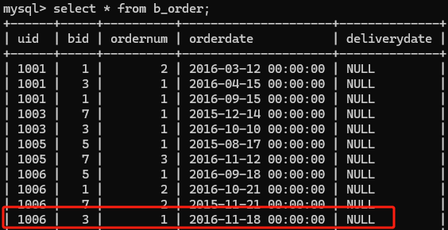
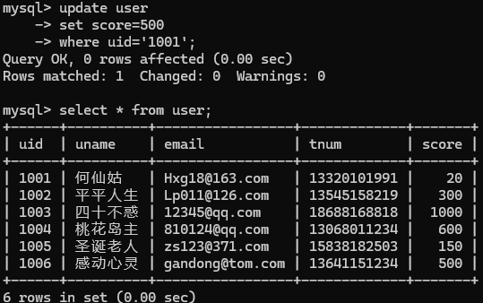
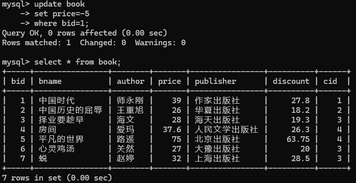

# 实验七 触发器（2学时）

### 【实验教学的目的】

1. 理解触发器的概念和作用。

2. 能够创建触发器

3. 了解如何管理触发器

### 【实验原理】

触发器是MySQL用来保证数据完整性的一种方法。它是指事先为某张表绑定若干条SQL语句，当对该表进行增、删、改操作的时候，系统会自动触发该表上绑定的代码并执行。

触发器按照事件分为：INSERT触发器、UPDATE触发器、DELETE触发器。

触发器按照时间分为：BEFORE触发器、AFTER触发器

创建触发器的语法如下：

```sql
create trigger 触发器名称 触发时间 触发事件 on 表名
for each row
trigger_stmt # 触发程序
```

### 【实验内容】

**题目：在“网上书店”数据库中创建触发器**

1. 在“网上书店”数据库中创建一个名为tri_1的触发器，当向订购表中插入记录时，如果订购量\<=0，就将订购量设置为1。（通过插入语句验证）

    ```sql
    DELIMITER $$
    CREATE TRIGGER tri_1
    BEFORE INSERT ON b_order
    FOR EACH ROW
    BEGIN
        IF NEW.ordernum <= 0 THEN
            SET NEW.ordernum = 1;
        END IF;
    END$$
    DELIMITER ;

    INSERT INTO b_order(uid, bid, ordernum, orderdate)
    VALUES ('1006', 3, -20, '2016-11-18');
    ```

    

2. 在“网上书店”数据库中创建一个名为tri_2的触发器，禁止用户修改user表中的score字段值。（通过更新语句验证）

    ```sql
    DELIMITER $$
    CREATE TRIGGER tri_2
    BEFORE UPDATE ON user
    FOR EACH ROW
    BEGIN
        IF OLD.score != NEW.score THEN
            SIGNAL SQLSTATE '45000'
                SET MESSAGE_TEXT = '禁止修改用户的积分！';
        END IF;
    END$$
    DELIMITER ;

    UPDATE user
    SET score = 500
    WHERE uid = '1001';
    ```

    

3. 在“网上书店”数据库中创建一个名为tri_3的触发器，在修改book表的纪录时，记录的price字段值或者为空，或者大于0。如果更新后的price值不满足此要求，则不允许修改该记录。（通过更新语句验证）

    ```sql
    DELIMITER $$
    CREATE TRIGGER tri_3
    BEFORE UPDATE ON book
    FOR EACH ROW
    BEGIN
        IF NEW.price IS NOT NULL AND NEW.price <= 0 THEN
            SIGNAL SQLSTATE '45000'
                SET MESSAGE_TEXT = '价格必须为正数或为空！';
        END IF;
    END$$
    DELIMITER ;
    
    UPDATE book
    SET price = -5
    WHERE bid = 1;
    ```

    

### 【主要实验仪器及设备】

计算机、MySQL
