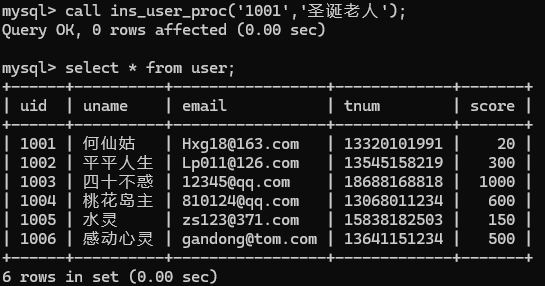
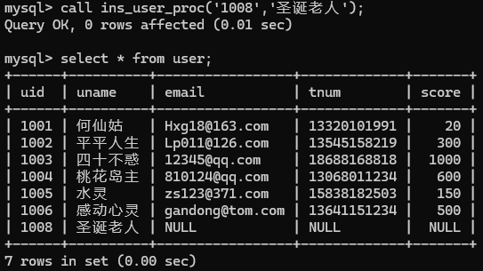

# 实验八 事务与锁（2学时）

### 【实验教学的目的】

1. 掌握事务的ACID特性。

2. 掌握事务的控制语句，包括开启事务、提交事务和回滚事务

3. 熟悉事务的隔离级别

### 【实验原理】

1. 开启/关闭自动提交：`set autocommit=1 | 0`;

2. 开始事务：`start transaction`;

3. 提交事务：`commit`;

4. 回滚事务：`rollback`;

### 【实验内容】

题目1：启动一个事务，在事务中使用SQL语句删除“网上书店”数据库中会员表的所有记录，第一次不提交事务，第二次提交事务，第三次回滚事务。重启MySQL服务器分别查看记录是否被永久删除。

第一次

```sql
SET autocommit = 0;
START TRANSACTION;
DELETE FROM user;
```

第二次

```sql
SET autocommit = 0;
START TRANSACTION;
DELETE FROM user;
COMMIT;
```

第三次

```sql
SET autocommit = 0;
START TRANSACTION;
DELETE FROM user;
ROLLBACK;
```

题目2：启动一个事务，在事务中使用SQL语句向“网上书店”数据库中图书表增添一条记录如下，第一次不提交事务，第二次提交事务，第三次回滚事务。重启MySQL服务器分别查看记录是否被永久删除。

| bid | bname  | author | price          | publisher | discount | cid |
|-----|--------|--------|----------------|-----------|----------|-----|
| 8   | 红楼梦 | 曹雪芹 | 人民文学出版社 | 30.8      | 20.8     | 3   |

第一次

```sql
SET autocommit = 0;
START TRANSACTION;
INSERT INTO book VALUES (8, '红楼梦', '曹雪芹', 30.8, '人民文学出版社', 20.8, 3);
```

第二次

```sql
SET autocommit = 0;
START TRANSACTION;
INSERT INTO book VALUES (8, '红楼梦', '曹雪芹', 30.8, '人民文学出版社', 20.8, 3);
COMMIT;
```

第三次

```sql
SET autocommit = 0;
START TRANSACTION;
INSERT INTO book VALUES (8, '红楼梦', '曹雪芹', 30.8, '人民文学出版社', 20.8, 3);
ROLLBACK;
```

题目3：创建存储过程ins_user_proc，通过开始事务，向user表插入记录（只需插入uid和uname两个字段的值），并调用存储过程进行验证，

验证方式：

`call ins_user_proc('1001','圣诞老人');`

`select * from user;`



`call ins_user_proc('1008','圣诞老人');`

`select * from user;`



```sql
DELIMITER $$
CREATE PROCEDURE ins_user_proc(IN p_uid CHAR(4), IN p_uname VARCHAR(20))
BEGIN
    DECLARE EXIT HANDLER FOR 1062
    BEGIN
        ROLLBACK;
    END;
    
    START TRANSACTION;
    INSERT INTO user (uid, uname) VALUES (p_uid, p_uname);
    COMMIT;
END$$
DELIMITER;
```

```sql
CALL ins_user_proc('1001', '圣诞老人');
SELECT * FROM user;

CALL ins_user_proc('1008', '圣诞老人');
SELECT * FROM user;
```


### 【主要实验仪器及设备】

计算机、MySQL
