# 猴博士-数据结构与算法

## 基础概念

### 逻辑结构与存储结构

逻辑结构描述数据元素之间的**关系**

- 一对一
- 一对多
- 多对多

存储结构描述实际存放数据元素的**物理**结构

一种逻辑结构可以用多种物理结构来实现
物理结构影响逻辑结构上的各种操作的复杂度。

### 算法与复杂度

#### 算法特性

有穷、确定、可行

#### 算法评价标准

正确、可读、健壮、高效

#### (最坏)复杂度

- 时间复杂度：给定输入规模n，在**最坏情况**下需要多少时间一定能做完

- 空间复杂度：给定输入规模n，在**最坏情况**下需要多少额外空间一定能做完

  复杂度是一个**保证**，一个承诺 (即上限；用**O**(数量级)表示)

#### Key

- 逻辑结构描述的是关系，与数据元素本身特点以及计算机参数等没有关系

  - 1.与数据元素本身的形式、内容、大小个数等无关的是数据的(B)
    A.存储结构 B.逻辑结构 C.存储实现 D.运算实现
  - 2.从逻辑上可以把数据结构分成(C)
    A.动态结构和静态结构 B.紧凑结构和非紧凑结构 C.线性结构和非线性结构 D.内部结构和外部结构
  - 3.下面哪个是非线性数据结构(A)
    A.树 B.字符串 C.队列 D.栈

- 算法的5个特性：有穷、确定、可行、输入和输出

- 算法的4个评价准则：正确性、可读性、健壮性、高效性

  - 1.对一个算法的评价，不包括如下(C)方面的内容
    A.正确性和可读性 B.健壮性 C.并行性 D.时间复杂度
    - 分析：给选项形容词前添加“不”字，如果可以接受，说明是评价准则，否则是必须满足的特性。如“不健壮”或“不高效”仍然是能作为一个算法的，只是不够完美。但“不可行”或者“不确定”就无法容忍了，一个算法不可行或无法给出确定结果则不能称之为算法。

- 算法复杂度是一个保证，用O(数量级)表示 (给定输入规模的情况下)(最坏情况/上限)

  - 1.分析下列算法(程序段)的时间复杂度：
    算法输入：n和m

    ```c
    int ans=0;
    for(int i = 0; i < n; i += 1) { // 执行n次
        for(int j = 0; j < m; j += 1) { // 执行m次
    		ans += 1;
        }
    }
    ```

    即n×m次，时间复杂度为O(nm)

  - 2.分析下列算法(程序段)的时间复杂度：
    算法输入：大小为n的数组nums，一个整数val

    ```c
    for(int i = O; i< n; i += 1) { // 执行n次
        if(nums[i]==val) {
            return i;
        }
    }
    ```

    即n次，时间复杂度为O(n)

  - 3.分析下列算法去(程序段)的时间复杂度：
    算法输入：n

    ```c
    int ans=0;
    for (int i = 0; i < n; i += 1) { // 执行n次
        for (int j =1; j < i; j *= 2) { // 执行log2(n)次
            ans+=1;
        }
    }
    ```

    - 分析：外层循环执行n次，因此外层复杂度是O(n)，内层循环与i有关，而i与n直接线性相关，因此内层循环的复杂度是O(log2(n))，内外层是嵌套关系，需要将复杂度相乘，得到总的复杂度为O(nlgn)。

  - 4.分析下列算法(程序段)的时间复杂度：
    算法输入：n

    ```c
    int ans=0;
    for(int i = 1; i <= n; i += 1) { // 执行n次
        if (i > 1000) break; // 但至多执行1000次
    	ans += i;
    }
    ```

    - 分析：无论输入n是多少，循环至多执行1000次，因此时间复杂度为O(1000)，也即常数复杂度，不管这个常数多大，我们都认为其为O(1)。

  - 5.在算法输入规模为n时，算法运行时间正比于9log(3n)，则该算法的时间复杂度为(O(n))

    - 分析：9log(3n=9nlog(3)，对于算法的复杂度分析时，我们不关系常数，只关心和输入规模n有关的数量级，因此0(9nlog(3))=== O(n)

## 线性表

### 线性表的顺序存储和链式存储

线性表(逻辑结构)；顺序存储/链式存储 (存储结构(物理结构))

线性表：一对一

- 顺序存储：按顺序放在一起，相邻元素通过内存地址相邻产生联系"**随机存取**"
- 链式存储：元素随机放置在内存中任意位置，每个元素除了存放数据，也保存了其相邻元素的
  内存地址来实现线性关系"**顺序存取**"

#### Key

1. 线性表是指各数据元素间保持“1对1”关系的数据结构
   1. 设顺序表中第一个元素的内存地址为100，单个数据元素长度为2，则第5个元素的地址为(B)
      A.110 B.108 C.105 D.112
   2. 链式存储的线性表中，每个数据元素所占的存储空间(A)
      A.分为两部分：结点值和维护节点间关系的指针 B.只有一部分：结点值
      C.只有一部分：维护结点间关系的指针 D.分为两部分：结点值和结点空间大小
   3. 设顺序表中有n个数组元素，则读取第i个数组元素的平均时间复杂度为(D)
      A.O(nlgn) B.O(n) C.O(n/2) D.O(1)
   4. 单链表的储存密度(<)1 (<,>或=)
2. 线性表分为顺序表(数组)和链表，分别通过**元素相邻**和保存**指针域**的方式来实现“1对1"


### 线性表基本操作(顺序表、(单)链表)

#### 顺序表

顺序表查找(定位)元素：按**值**查找

- 给定长度为n的线性表，查找值为v的元素
- (最坏)从头到尾遍历=>时间复杂度O(n)

顺序表新增/删除元素

- 给定长度为n的顺序表，在指定位置i插入一个新元素
- 给定长度为n的顺序表，删除位置i的元素
- 需要将位置i到位置n-1的所有元素都向后或向前挪一格
- 在**最坏情况**(i=0)下，需要挪动全部的n个元素=>时间复杂度为**O(n)**
- 无需利用额外空间=>空间复杂度为O(1)

顺序表更新元素

- 给定长度为n的顺序表，更新位置i的元素
- 无论i的值如何，都可以通过i直接访问位置i元素，将其更新为v’=>时间复杂度
  为0(1)=>**随机存取**

#### (单)链表

(单)链表新增元素

- 给定长度为n的顺序表，在第i个结点插入一个新元素
- **寻找前驱节点：**首先需要从头结点开始逐个向后找**i-1**次=>时间复杂度为O(n)
- 找到后插入只需要修改第i-1个结点和待插入结点的[后继结点地址]即可=>O(1)
- 无需利用额外空间=>空间复杂度为O(1)
- **TIPS：一定注意要先把新节点指向后继后，再把前趋指向新节点**

(单)链表删除元素

- 给定长度为n的单链表，删除第i个结点
- 需要移动到第i个结点的前驱结点，最坏情况下移动n-1次=>时间复杂度为O(n)
- 修改前驱结点的后继指针=>O(1)
- 无需利用额外空间=>空间复杂度为O(1)

(单)链表更新元素

- 给定长度为 n 的顺序表，更新第i个结点的值
- 需要从头结点开始按顺序找到第1个结点才能访问并更新它=>顺序存取
- 最坏情况遍历整个链表=>时间复杂度为0(n)

#### Key

1. 顺序表中增加和删除一个元素将导致该位置后的元素前移或后移，复杂度为O(n)
   1. 设顺序表中有n个元素，往其插入或从其删除一个元素，平均要移动的元素个数为(2/n)
   2. 往一个长度为127的顺序表中插入一个元素，平均要移动的元素个数为(B)
      A.8 B.63.5 C.63 D.7
   3. 设顺序表中有n个元素，则时间复杂度为O(1)的操作是(A)
      A.访问第i个结点(i∈[1,n]) B.删除第i个结点(i∈[1,n])
      C.在第i个结点后插入一个新元素(i∈[1,n]) D.将顺序表从小到大排序
2. 单链表增加和删除元素虽然不用移动元素，但需先找到其前驱结点，复杂度为O(n)
   1. 下列说法正确的是(C)
      A.如果插入操作频繁发生在表头部，顺序表和单链表效率接近
      B.如果删除操作频繁发生在表头部，顺序表比单链表效率更高
      C.如果插入操作频繁发生在表尾部，顺序表比单链表效率更高
      D.如果删除操作频繁发生在表尾部，顺序表和单链表效率接近
3. 若线性表需要频繁更新元素->选择用顺序表实现(数组)
4. 若线性表需要频繁插入删除元素->选择用链式表实现
   1. 下列说法错误的是(~~B~~)D
      A.对于顺序表和链表来说，定位元素的效率接近
      B.顺序存储的线性表可以随机存取
      C.顺序表需要物理上连续的内存空间，因此存储管理不够灵活
      D.线性表的顺序存储实现优于链式存储结构

### 线性表合并操作

#### 线性表的集合式合并：只合并不同元素

- 设A表长度为**n**，B表长度为**m**
- 对于B表中的每个元素，都需要先判断其是否已经存在A里=>O(mn)
- 如果存在，无需插入，如果不存在，将其插入在A的末尾=>O(1)
- 总时间复杂度为O(mn)
- 空间复杂度
  - 顺序表：O(m+n)
  - 链表：O(1)

#### 合并两个有序表：本来分别有序，合并结果仍然有序

- 设A表长度为n，B表长度为**m**
- 先预留结果表空间：n+m个元素
- 从表头开始同时逐个访问A表和B表元素，将当前位置上较小者放入结果表并后移一位
- 总时间复杂度为O(m+n)
- 空间复杂度为O(**m+n**)

#### 合并两个有序单链表

- 设A表长度为**n**，B表长度为**m**
- 先创建一个头结点(哑结点dummy)，其数据没有实际意义，只为用它的**[指针域]**
- 从表头开始逐个同时遍历A和B，将**当前已完成合并的表尾元素**的后继节点设置为当前A和B游
  标中较小的一个，并将该游标向后移动一位
- 时间复杂度为O(m+n)
- 空间复杂度为O(**1**)

#### Key

1. 合并两个有序表：逐一比较两表当前元素，将正确的元素添加进结果表并移动游标
   1. 合并两个长度为n的有序表，可能的最小比较次数为(C)
      A.2n B.2n-1 C.n D.1

### 代码实现

[线性表-顺序表](https://github.com/mole9630/UNotes/tree/main/大三上/数据结构与算法/校内课程-实验课笔记/241011) | [线性表-链表](https://github.com/mole9630/UNotes/tree/main/%E5%A4%A7%E4%B8%89%E4%B8%8A/%E6%95%B0%E6%8D%AE%E7%BB%93%E6%9E%84%E4%B8%8E%E7%AE%97%E6%B3%95/%E6%A0%A1%E5%86%85%E8%AF%BE%E7%A8%8B-%E5%AE%9E%E9%AA%8C%E8%AF%BE%E7%AC%94%E8%AE%B0/241018)


### 栈与队列

### 栈和队列的特征

栈：**后**进先出(LIFO)

- 栈：受限制的线性表，只允许从表的一端操作，这端称为**栈顶**，另一端为**栈底**
- 压入元素(**push**)：往栈顶新增一个元素，新元素成为新栈顶
- 弹出元素(**pop**)：移除栈顶元素，原栈顶下的元素成为新栈顶/或栈变为空栈

队列：**先**进先出(FIFO)

- 队列：受限制的线性表，只允许从表的两端操作，一端为**队首**，一端为**队尾**
- 入队(**enqueue**)：往队尾新增一个元素，新元素成为新队尾
- 出队(**dequeue**)：移出队首元素，下一个元素成为新队首/或队列变为空

#### Key

1. 栈是一种**先进后出**的数据结构，Pop和Push操作仅在栈顶进行
   1. 设入栈序列为1234，则出栈序列不可能是(C)
      A.1234 B.1324 C.4312 D.3214
   2. 设入栈序列为ABC，则可能的出栈序列种类有(~~C~~ D)种
      A.1 B.3 C.4 D.5
      - 分析：考虑A在出栈序列中的位置，有3种可能性，若A第一个出栈，该情况的总数量为B和C出栈序列的种类数，共”BC”和”CB“两种；若A第二个出栈，那B必然在它前面，C必然在它后面，只有一种情况；若A第三个出栈，则该情况总数也为B和C出栈序列的种类数。因此答案2+1+2=5
   3. 设入栈序列为1,2,3...n，出栈序列为p~1~，p~2~，p~3~...p~n~，若p~1~=n，则p~i~为(C)
      A.i B.n-i C.n-i+1 D.不确定
      - 分析：p~1~=n说明第一次pop发生在n入栈后，也即所有元素入栈后，此后栈内剩下的元素只能按照插入顺序的逆序依次出栈。
        根据栈LIFO的特性，出栈序列中的每一个p~i~都满足i+p~i~=1+n，因此p~i~=n-i+1

### 栈和递归

- 栈后进先出的特点天然地和程序中函数调用的关系相吻合
- 程序执行时，在函数A中执行到调用另一个函数B的语句时，会立刻进入被调函数B执行其代码，完成后返回到A的下一行继续执行A的剩余代码
- 因此在操作系统执行代码时，函数间的调用-返回关系正是通过**调用栈**来维护
- **★**函数的递归调用本质也是一个栈型调用，因此可以利用栈将一个递归函数改写为
  完全等价的非递归函数，避免了操作系统层面的调用栈开销

### 栈和队列的应用

#### 栈的应用：括号匹配

- 目的：判断一个字符串中括号是否匹配
- [{(O)}->匹配，[{(D)}->不匹配
- 当遇到一个左括号时，我希望能立刻遇到它的另一半，但如果紧接着又遇到了一个左括号
  那它的需求比我更紧迫，我需要**先**处理**后**来的这个左括号
- 后来的需要先满足->后进先出问题->用栈解决

#### 栈的其他应用

- 表达式求值，如求1+2*3
- 进制转换
- 非递归的深度优先遍历(DFS)

#### 队列的应用：循环队列

- “**假溢出**”现象：底层顺序表前部的可用空间无法再利用上了

### 代码实现

[顺序栈](https://github.com/mole9630/UNotes/tree/main/大三上/数据结构与算法/校内课程-实验课笔记/241025)|[循环队列](https://github.com/mole9630/UNotes/tree/main/大三上/数据结构与算法/校内课程-实验课笔记/241101)

#### 循环队列实现

循环队列的底层是一个数组，通过维护队头和队尾在此数组中的下标来实现

#### Key

1. 顺序栈的底层是一个数组空间，并通过维护当前栈大小实现栈

2. 顺序栈的当前栈顶元素下标和栈大小是top=size-1的关系

   1. 设Stack是顺序栈的一种实现，(a)处应填入的代码为(stk.size--)
      ```c
      struct Stack {
          Elem data[MAX_SIZE];
          int size = 0;
      }
      void Pop(Stack &s) {
      if (stk.size == 0) return false;
          (a);
          return true;
      }
      ```

3. 循环队列的容量是 MAX_SIZE-1

4. 循环队列当前元素数量计算

   1. 假设一循环队列的底层数组为array[M]，我们约定f表示为当前队首元素，b为当前队尾元素
      的后一个元素，则当前队列内元素个数为(B)
      A.b-f B.(b-f+M)%M
      C.b-f+M D.(f-b+M)%M

5. 首尾相接：循环队列判满条件为`(back+1)%MAX_SIZE==front`

6. 首尾重合：循环队列判空条件为`back==front`

   1. (a)处应填入的代码为(`queue.front==queue.back`)
      ```c
      bool Dequeue_CQ(CQueue &queue) {
          if((a))
          return false；//头尾重合表示队列为空
          queue.front = (queue.front + 1) % queue.capacity; //queue.capacity(即M)
          return true;
      }
      ```


## 树与二叉树

**理解**以下名词：

- 树、森林、二叉树
- 根、孩子、子树、叶子节点
- 树的高度与结点的度
- 满二叉树与完全二叉树
- 顺序二叉树、链式二叉树
- 先序/中序/后序遍历
- 哈夫曼树与哈夫曼编码

**熟悉**以下过程及其复杂度：

- 树的4种遍历过程
- 森林/树转换为二叉树
- 构建哈夫曼树

**理解**以下关键代码：

- 二叉树先序/中序/后序遍历的递归实现
- 利用队列实现二叉树的BFS
- 求树高度的递归实现

**熟练**以下题型：

- 二叉树结构的各种数值计算
- 给定森林/树，转化为二叉树
- 给定中序+先序/后序序列，还原二叉树结构
- 给定二叉树，写出其各种遍历的结果序列
- 给定字符频率表求哈夫曼编码

### 树和森林

- 树：一对多的结构(可1对0，1对1，1对多)，有一个起点"根结点"
- 结点：树的一个数据元素
- 孩子：1对多里的"多"
- 子树：以某个孩子结点为根的一棵树
- 叶子结点：没有孩子的结点
- 森林：多棵树

### 二叉树结果

#### 二叉树

- 二叉树：每个结点**至多**有两个孩子(可以1个或0个)(度至多为2)，分别称为**左孩子**和**右孩子**
- 左孩子(若有)是左子树的根，右孩子(若有)是右子树的根
- 高度(深度)：**最深**的叶子结点所在层数

#### 二叉树的重要性质

- 第i层至多有2i-1个结点

- 高度为h的树至多有2h-1个结点

  | 层号(高度) | 叶子节点上限 | 结点总目上限 |
  | :--------: | :----------: | :----------: |
  |     1      |      1       |   2^1^-1=1   |
  |     2      |      2       |   2^2^-1=3   |
  |     3      |      4       |   2^3^-1=7   |
  |     4      |      8       |  2^4^-1=15   |
  |    ...     |     ...      |     ...      |
  |     i      |    2^i-1^    |    2^i^-1    |

#### Key

1. 二叉树每个结点有0或1或2个孩子，叶子结点没有孩子
2. 二叉树的高度指从根节点向下直至最深叶子结点的高度
   - 由3个结点可以构成多少棵结构不同的二叉树？(D)
     A.2 B.3 C.4 D.5
   - 一棵二叉树有1025个结点，则其高度为(~~D~~)C
     A.10 B.11 C.11至1025之间 D.10至1025之间

#### 两种特殊的二叉树

- 满二叉树(FULL)
  - 装满的二叉树，高为h=>有2h-1个结点
- 完全二叉树(Complete)
  - 只在最下一层的最右边有空缺

#### Key

1. 满二叉树是满的，完全二叉树只是完整了，但不一定满

   - 一棵完全二叉树有1001个结点，则其叶子结点个数为()
     A.250 B.254 C.500 D.501

     - 分析：

       此类题目首先找该完全二叉树T1的上层满二叉树T2。
       因2^9^-1<1001<2^10^-1，所以T2是一棵高度为9的满二叉树，其叶子结点数量为2^8^=256，总结点数为2^9^-1=511
       则T1最后一层左端有1001-511=490个叶子结点
       这些结点能作为T2叶子结点中490/2=245个结点的孩子，使其变为非叶结点
       则T2仍剩256-245=11个叶子结点，答案为11+490=501

#### 树/森林转换为二叉树

- 树转为二叉树
  - 每个结点只保留第一个孩子(老大)作为左孩子，剩下的孩子(老大的兄弟们)依次接到老大的右孩子链上
- 森林转为二叉树
  - 各树分别转为二叉树
  - 各树根用右孩子链相连

#### Key

1. 森林向二叉树转化是确定且唯一的过程
   - 将一棵树转换为二叉树后，其形态(A)
     A.是唯一的 B.有多种 C.有多种，但根结点都没有右孩子 D.有多种，但根结点都没有左孩子
     - 分析：是唯一的，且根结点没有右孩子

#### 二叉树顺序存储实现

- 顺序二叉树(底层是数组）
- 顺序树中结点i的左右孩子分别是2i+1和2i+2(i从0开始计数)
- 若结点为空，使用特殊值(如0)表示

#### 二叉树链式实现

链式树(二叉链表)

```c
typedef struct TreeNode {
    int data;
    struct TreeNodee *left;
    struct TreeNode *right;
} TreeNode;
```

### 二叉树的遍历

- 遍历：按某种确定的次序逐个访问所有结点 (时间复杂度是O(n))
- 先序遍历：**当前结点**-左子树-右子树
- 中序遍历：左子树-**当前结点**-右子树
- 后序遍历：左子树-右子树-**当前结点**
- 层序遍历：逐层从左向右遍历各个结点

#### 二叉树先序/中序/后序遍历

- 注意：右孩子是右子树的根，左孩子是左子树的根
- 注意：一棵树是用其根结点表示的，因从根结点出发我们足以访问整棵树
- 先序遍历：**根**左右
- 中序遍历：左**根**右
- 后序遍历：左右**根**

#### Key

1. 二叉树三种遍历顺序中，左子树都先于右子树，区别在于访问根的次序

2. 可以通过中序+先序/后序序列之一来还原二叉树结构，先+后则不行

   - ★一颗二叉树的先序遍历序列为3541982，中序遍历序列为5413892，请还原其结构

     - 分析：

       中+先/后还原树结构的问题，关键点在于可以通过先/后序序列**确定根结点**，再通过中序遍历里
       根结点的位置**划分左右子树**，问题减小为分别还原左右子树，依次逐层往下直至还原完成。

### 哈夫曼树

#### 哈夫曼树和哈夫曼编码

- 初始时，一堆独立结点，结点有自己的权值
- 重复地让当前**权值最小**的两个**根结点**作为左右孩子，**生成**新的根结点，新结点权值为它们的**权值之和**，直至形成一颗二叉树

#### 哈夫曼树的特点

- 越靠近根节点，权值越大
- 初始结点全是后来的叶子结点
- 叶子结点权值越大，离根结点越近=>路径越短
- 每一个叶子结点有一个唯一编码(不定长)
- 最大程度节省空间！越常用的字符码长越短。
- **题型**：给一个字符-频率表，构造哈夫曼树来求哈夫曼编码表

### 代码实现

[图1](https://github.com/mole9630/UNotes/tree/main/%E5%A4%A7%E4%B8%89%E4%B8%8A/%E6%95%B0%E6%8D%AE%E7%BB%93%E6%9E%84%E4%B8%8E%E7%AE%97%E6%B3%95/%E6%A0%A1%E5%86%85%E8%AF%BE%E7%A8%8B-%E5%AE%9E%E9%AA%8C%E8%AF%BE%E7%AC%94%E8%AE%B0/241122) | [图2](https://github.com/mole9630/UNotes/tree/main/%E5%A4%A7%E4%B8%89%E4%B8%8A/%E6%95%B0%E6%8D%AE%E7%BB%93%E6%9E%84%E4%B8%8E%E7%AE%97%E6%B3%95/%E6%A0%A1%E5%86%85%E8%AF%BE%E7%A8%8B-%E5%AE%9E%E9%AA%8C%E8%AF%BE%E7%AC%94%E8%AE%B0/241129)


## 图

**理解**以下名词：

- 有向图/无向图，加权图
- 度 (入度/出度)
- 连通与连通分量
- 稀疏和稠密
- 邻接矩阵和邻接表
- DFS和BFS
- 贪心思想
- 最小生成树与Prim算法
- 迪杰斯特拉算法
- 有向无环图与拓扑排序
- AOE网络
- 关键活动与关键路径

**熟悉**以下过程及其复杂度：

- 图的DFS和BFS
- Prim算法过程
- 迪杰斯特拉算法过程
- *拓扑排序过程

**理解**以下关键代码：

- *利用递归实现DFS
- *利用队列实现BFS

**熟练**以下题型：

- 和图的数值特征有关的计算
- 图的两种表示方式以及比较
- **给定图/邻接矩阵/邻接表，DFS与BFS全过程模拟**
- **给定图/邻接矩阵/邻接表，模拟最小生成树的生成过程(Prim算法)**
- **给定图/邻接矩阵/邻接表，模拟迪杰斯特拉算法过程**
- ***AOE网络求解关键路径**

### 图的基本概念(多对多的逻辑结构)

- 假设ABCDEFG是7个电话，之间的连线表示修有通信线路(A-B-C-D-E F-G)
- 电话就是图的**顶点**v~i~∈V，通信线路是**边**e~i~∈E，G={V,E}就是一个图 (V=Vertice；E=Edge)
- 只要两个电话间有线路，就可以相互通话=>**无向图**
- 电话(顶点)连接的线路(边)数量：**度**
- ABCDE和GF之间消息无法传递：**不连通**
- ABCDE和GF是两个**连通分量**
- 若边上有数值，则是**加权图**
- 若带箭头连线的图，则是**有向图**
- **入度**：其他订单箭头指向该顶点的数量
- **出度**：该顶点指向其他顶点的数量

#### Key

1. 在一个无向图中，所有顶点的度数之和为边数量的2倍
2. 在一个有向图中，所有顶点的出度之和==所有顶点的入度之和
   - 无向图G={V，E}中，|V|=n，则|E|最大为(D)
     A.n B.n^2^ C.n(n-1) D.n(n-1)/2
     - 分析：n个结点，每个结点都与除自己外其他结点间有一条边相连，而一条边连接了两个结点，因此答案为n(n-1)/2
   - 从某一城市出发，可以沿着高速公路经或不经中转抵达所有其他城市，则这几个城市是(D)
     - A.有向的 B.强连通的(仅适用于有向图) C.加权的 D.连通的

### 邻接矩阵和邻接链表

#### 邻接矩阵

- 设|V|=n，图可用一个n*n方阵表示
- 即一个二维数组`AdjMat[n][n]`
- `AdjMat[i][j]`表示v~i~和v~j~的邻接情况

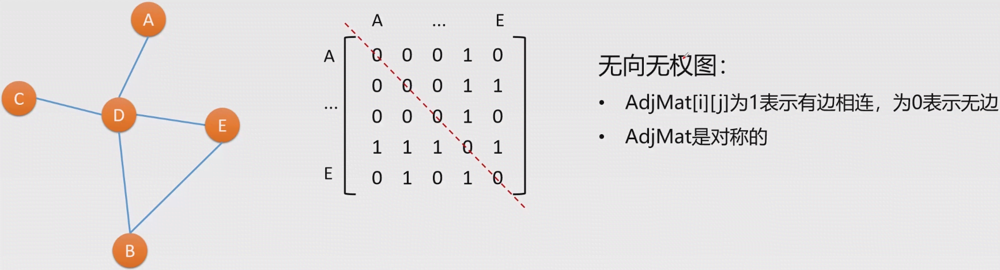

- 设IVl = n，图可用一个n*n方阵表示
- 即一个二维数组`AdjMat[n][n]`
- `AdjMat[i][j]`表示v~i~到v~j~的邻接情况

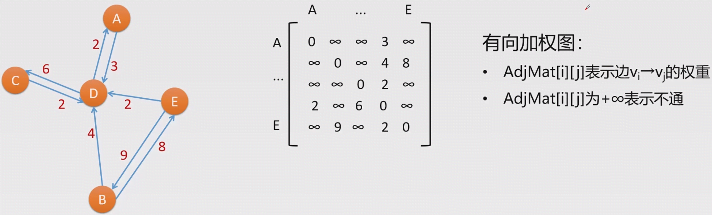

#### 邻接表

- 每个顶点用一个链表存下自己的邻居
- |V|=n，有n个链表，即图可用一个链表的数组`AdjList[n]`存储
- `AdjList[i]`表示顶点v~i~的链表(头)
- 从`AdjList[i]`开始可以遍历所有以v~i~的邻居

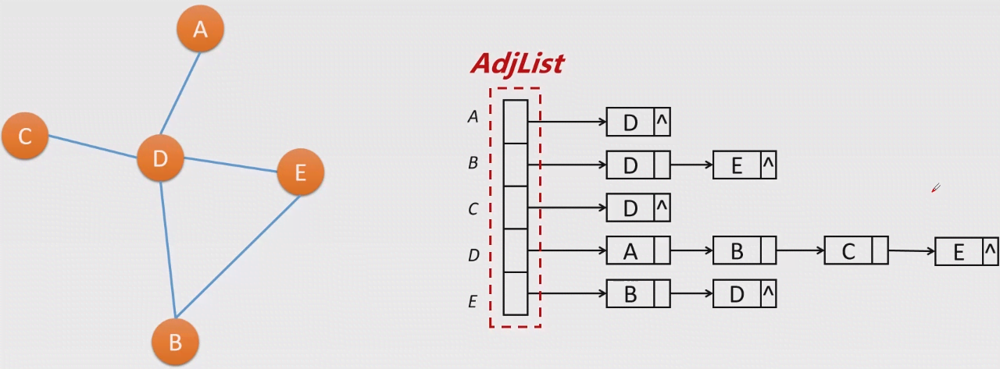

#### 邻接矩阵和邻接表的比较

- 设G = {V, E}, IMI = n.
- 邻接矩阵无论如何都需要一个二维数组`[n][n]`，而邻接表中每条链表长度取决于它有多少邻居
- 邻接矩阵访问`AdjMat[i][j]`是O(1)的，但邻接表访问特定边需要顺着起点的链表向后查找
- 邻接表的优点：
  - 在边较少时节省许多空间=>适用于稀疏图 (邻居少=>即边较少)
- 邻接表的缺点：
  - 无法直接获得某条边信息，需要v~i~链表进行从头顺序存取，最坏情况下O(n)

### 图的DFS和BFS遍历

#### DFS:深度优先遍历(Depth First Search)

- 遇到新的邻居就进去...直到没有可以进的邻居了再返回
- 优先进入后来遇到的邻居=>递归/栈

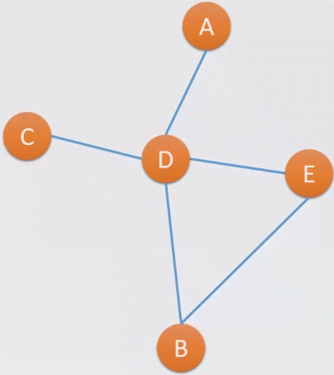

以B为起点进行DFS：

- 访问B
  - 访问B的下一个未访问邻居D
    - 访问D的下一个未访问邻居C
      - C所有邻居都被访问过了，返回
    - 访问D的下一个未访问邻居A
      - A所有邻居都被访问过了，返回
    - 访问D的下一个未访问邻居E
      - E所有邻居都被访问过了，返回
    - D所有邻居都被访问过了，返回
  - B所有邻居都被访问过了，**当前连通图**遍历完毕

#### BFS:广度优先遍历(Breath First Search)

- 先把当前结点的邻居都遍历完，再按先来后到遍历邻居的邻居们，**逐层向外**扩张 (层序遍历)
- 优先进入先访问的邻居的邻居=>队列


| 以B为起点进行DFS                          | 队列        |
| ----------------------------------------- | ----------- |
| 将起点B入队                               | ←[B]←       |
| 访问当前队首B，它出队，未访问邻居D, E入队 | ←[D, E]     |
| 访问当前队首D，它出队，未访问邻居A, C入队 | ←[E, A, C]← |
| 访问当前队首E，它出队，它没有未访问邻居了 | ←[A, C]←    |
| 访问当前队首A，它出队，它没有未访问邻居了 | ←[C]←       |
| 访问当前队首C，它出队，它没有未访问邻居了 | ←[]←        |

#### Key

1. DFS每步操作：进入当前结点下一个未访问的邻居，如无则返回
2. BFS每步操作：进入当前队首结点并让其出队，将其未访问邻居入队

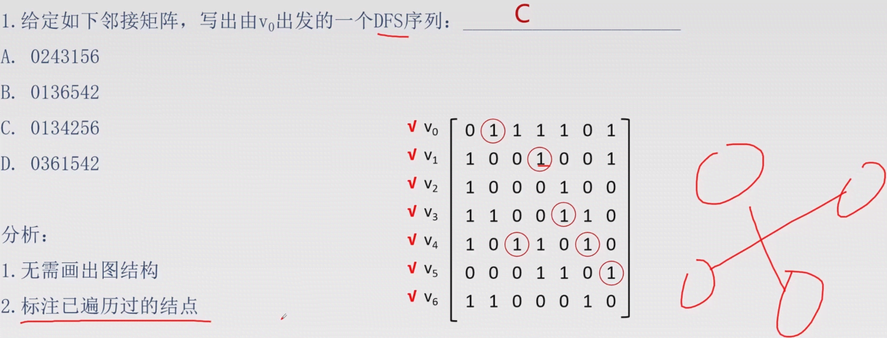

### 最小生成树

#### 生成树

- 对于含n个结点的一个无向连通图，其边数最多为n(n-1)/2 条，最少为n-1条
- 保持连通性的情况下，选 n-1条边出来，剔除其他边，它就变成了一颗树
- 生成树没有环
- n结点+n-1条边+连通 => 生成树

#### 最小生成树(Minimun Spanning Tree)

- 在加权图中选出n-1条边来构成其生成树，且这些边的权值之和最小
- (MST)不一定唯一(如权值全相同)

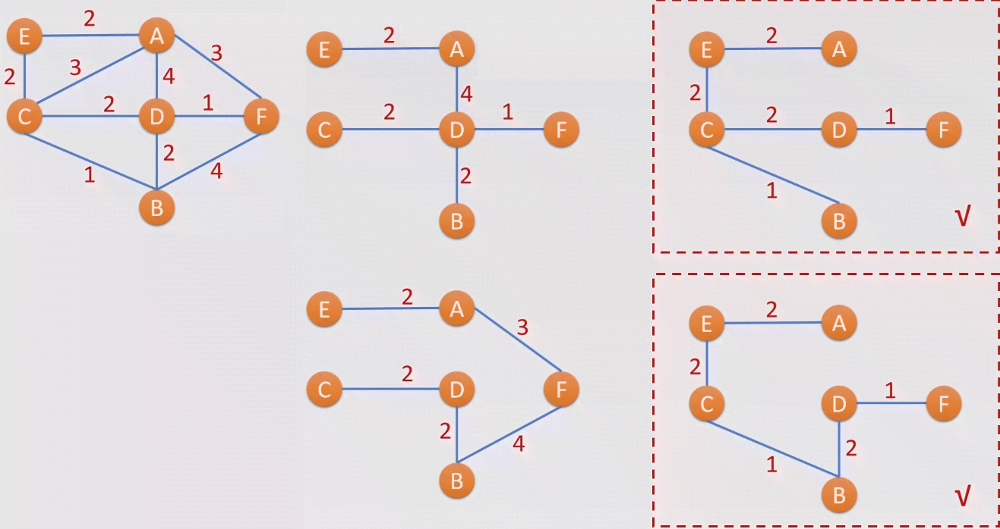

##### Prim算法(加点法)

- 每次在连接已完成结点和未完成结点的边中，选一条权值最小的，重复n-1遍
- 算法利用了贪心思想：选择局部最优

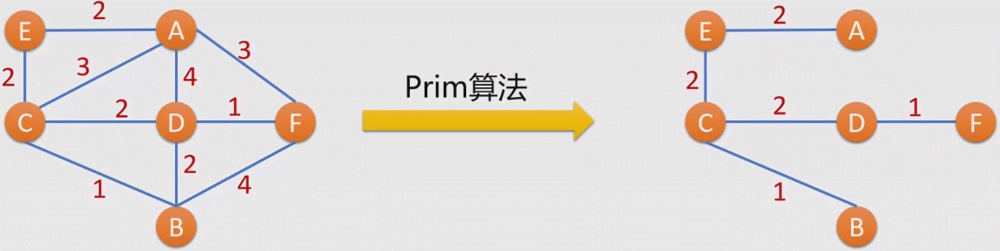

#### Key

1. Key1：Prim算法是**加点法**，逐步增加n-1个点来形成MST
2. Key2：Prim算法每次加点满足
   1. 这个点所属边的权值最小
   2. 加点不会形成环

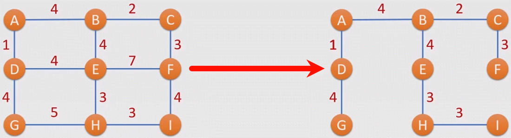8

### 迪杰斯特拉算法

#### 单源点最短路径：Dijkstra算法

- 加权图中求从一个顶点s出发到图上其他各点的最短距离
- |M| = n，算法循环n-1次，每次循环中:
  - 找到未完成结点中，s->t距离最短的t，将t标注为已完成
  - 以t为中转更新s至t的邻居们的距离

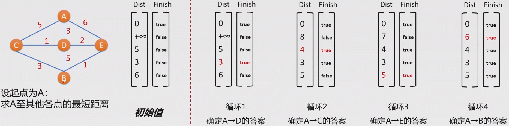

### 拓扑排序

- 有向无环图

### AOE网络与关键路径求解

#### AOE网络、关键活动、关键路径
- 考试会给一个AOE网络，求关键活动和关键路径
- 方法：求每个结点的**最早/最晚发生时间**V~E~和V~L~，以及每个活动的**最早/最晚开始时间**e~E~和e~L~
  1. 按照拓扑排序，求出所有结点的V~E~
  2. 令终点的v =V~E~，按照拓扑排序的逆序，求出所有结点的V~L~


## 串

#### (字符)串

- 串是一个特殊的线性表，其数据元素全是单个字符，也称字符串："abcdl12_!"
- 长度为零的串里什么都没有，叫空串：“”
- 全由空格组成的串叫空格串，空格也是字符，空格串≠空串：” ”或"_ _"(-表示空格)

#### 回文串
- 长度为 L 的字符串的索引[范围：[1, L] 或 [0, L-1]
- 回文：如”上海自来水来自海上“
  - 索引从0开始：s[i] == s[L-i-1]
  - 索引从1开始：s[i] == s[L-i+1]

#### 字符串匹配

- 给定一个主串s，和一个模式串t，返回t首次在s中出现的位置，若从未出现则返回-1

|   主串    |  模式串  | 匹配结果 |
| :-------: | :------: | :------: |
| "aabbccd" |  "bbc"   |    3     |
| "kkaakk"  |   "kk"   |    1     |
|  "happy"  | "happyy" |    -1    |
| "python"  |    ""    |    1     |
| "python"  | "python" |    1     |
| "python"  |  "abc"   |    -1    |

#### 字符串匹配问题的暴力求解：BF算法

- 给定一个主串s，和一个模式串t，返回t首次在s中出现的位置，若从未出现则返回-1
  - 首先判断s的长度大于等于t，否则直接返回-1
  - 逐一选择s中的位置i:
    - 若s[i:L]>=t的长度，则从s[i]开始与t进行**逐字符**比对
    - 匹配失效则**回溯**到i+1从t的首字符重新开始
- 时间复杂度是O(m*n)

#### *字符串匹配KMP算法

- 暴力求解的BF算法效率为什么低？
  - 因为每次匹配失效都进行回溯
- KMP算法是一种利用提前计算**部分匹配前缀表**来避免回溯的算法
  - 提前计算模式串t的next数组
  - 匹配过程中发生失效时，直接根据next数组滑动模式串，无需回溯


## 查找

**理解**以下名词：

- 二分查找
- 二叉查找树和AVL树
- AVL树的旋转
- 哈希函数、冲突与冲突解决
- 开放地址法去（线性探测、二次探测)
- 链地址法

**熟悉**以下过程及其复杂度：

- 在有序顺序表上进行二分查找
- 在二叉查找树上进行查找
- 解决哈希冲突

**熟练掌握**以下算法的代码：

- 二分查找代码
- 二叉查找树查找目标值

**熟练**以下题型：

- 给定一个有序数组，计算二分查找所需比较次数
- 给定一个有序数组，写出二分查找逐步比较元素
- 给定插入序列，写出生成的二叉查找树结构
- 给定插入序列和指定冲突解决方法，构造哈希表

### 二分查找(折半查找)

- 在长度为 n 的有序顺序表 List 中顺序查找一个目标值 => O(n)
- 在比较失效时，利用表的**有序性**排除**待查找元素**中的一半
- 每次排除一半 => O(lg(n))

#### 算法流程

1. 用I和r 表待查找范围的左右边界(含)，初始时I=0,r=n-1
2. 循环以下操作直至l>r:
   - 找当前搜索范围的正中间：mid=(l+r)/2
   - 判断target和List[mid]的关系:
     - `==`：找到了结果，返回mid
     - `<`：target只可能在mid位置左边，排除mid及其右侧所有元素=>即更新r=mid-1
     - `>`：target只可能在mid位置右边，排除mid及其左侧所有元素=>即更新l=mid+1
3. 循环能结束说明数组中不存在target，返回-1

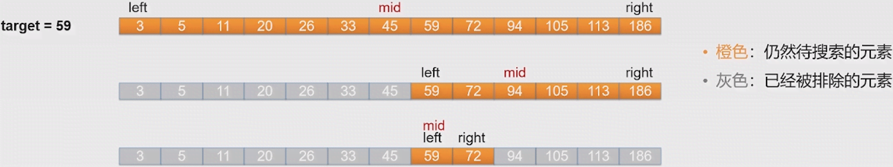

#### 牢记

- 二分查找只能发生在**有序数组**上
- 时间复杂度为**O(lgn)**
- 代码简单，尽量掌握

#### Key

1. 二分查找只能用于**有序数组**：需要通过下标直接访问元素

   - 顺序查找可以用于(~~B~~ C)
     A.单链表 B.顺序表 C.顺序表或单链表 D.二叉树
   - 对线性表进行二分查找时要求该线性表(B)
     A.是单链表，且必须有序 B.是顺序表，且必须有序
     C.是顺序表，可以无序 D.是单链表，可以无序

2. 二分(折半)查找过程：①找中 ②折半

3. 二分查找每次排除一半，至多log~2~(n)+1次后结束 => 复杂度为O(lg(n))

   - 在有序数组[6,13,19,22,43,48,66,71,109,133,210]上进行二分查找：
     (1)查找元素x至多进行(~~3~~ 4)次比较
     分析：数组长度为11，因为23=8，24=16，所以3<log~2~(11)< 4，所以至多需要4次折半才可
     以保证没有待搜索元素了

     (2)查找元素67共进行(4)次比较，返回值为(-1)
     分析：依次比较元素为：48，109，66，71，就能发现数组中没有67，返回-1

     (3)查找元素43依次发生比较的元素是(48，19，22，43)
     分析：依次比较元素为：48，19，22，43，注意`l==r-1`时，`(l+r)/2==l`

### AVL树

#### 二叉搜索树 / 二叉查找树 / 二叉排序树

- 二叉查找树中的任何一个结点都满足:
  - 左子树如果不空，贝则左子树所有结点都<本结点
  - 右子树如果不空，则右子树所有结点都>本结点
  - 其左右子树都是二叉查找树
- 总结：**左小右大**

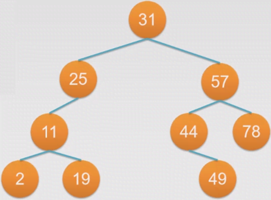

##### 查找目标值

- 查找目标值:
- 如果target<当前结点，进入左子树
- 如果target>当前结点，进入右子树
- 如果进入空结点表明树中无target

##### 给定序列构造二叉查找树

- 给定一个序列{31,25,57,11,44,78,2,49,19}，将其依次插入一棵二叉查找树
- 方法:
  - 第一个元素为根
  - 从第二个元素开始，逐个按照**小往左大往右**的原则插至叶子结点


#### AVL树(平衡二叉查找树)

- 思考：从序列{1,2,3, 4,5...n}依次插入构造出的二叉查找树
- 即元素都在右侧，退化成一个单链表，查找目标值的时间复杂度为O(n)
- AVL树：尽量保持一棵二叉查找树的**平衡性**:
  - 每一个结点的左右子树的高度差<=1
- 方法:
  - 如果插入一个结点导致树不平衡，通过**旋转**调整回平衡
    - 旋转：解决了二叉查找树不平衡的问题

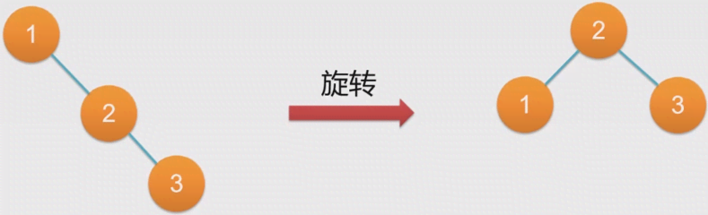

#### Key

1. 二叉查找树中任意结点：>左子树**所有结点**，<右子树**所有结点**

2. 二叉查找树查找：**左小右大**

3. 二叉查找树插入：**小往左，大往右**

   - 给定表{19，8，67，3，81，2，26}，将其依次插入初始为空的二叉查找树，画出树结构:

     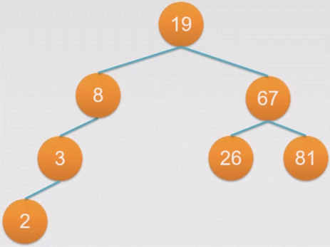

4. AVL树：任意结点左右子树高度差<=1
5. 当插入或删除导致AVL树不平衡则需要进行**旋转**使其重新平衡
6. 二叉查找树的**中序**遍历就是其所有元素的有序序列
   - 写出下列二叉查找树的中序遍历序列(2 3 8 19 26 67 81)
     

### 哈希表(散列表)

- 前面介绍的两种查找都需要维护元素的有序性，但我们只是单纯地想知道：有or没有
- 所以可以建立**元素值->数组下标**的**<u>映射</u>**(哈希),，直接判断目标值是否存在<u>结构</u>(哈希表)中
- 例：元素为{22，6，19，18，2}，通过假设哈希函数为h(x)=x%7
  元素为{22，6，19，18，2}，构造了哈希表:
- (哈希函数)的映射关系将其映射到数组对应位置上
- 查找19：直接计算19%7=<u>5</u>(哈希值)，访问nums[5]=>判断查找成功
- 查找24：直接计算24%7=<u>3</u>(哈希值)，访问nums[3]=>判断查找失败

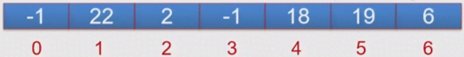

#### 哈希表冲突


- 假设哈希函数为h(x) = x%7，元素为{22，6，19，18，2}，构造了哈希表
- 现在插入元素29:
  - 计算哈希值h(29)=29%7=1
  - 试图将29放入nums[1]，发现nums[1]已经放了22 =>产生了**冲突**

##### 哈希表冲突解决方法1：开放地址法(线性探测法)

- 继续下一级哈希：h~1~= (1+**1**)%7
- 仍然冲突？再哈希：h~2~=(1+**2**)%7 ······
- 直至哈希至：h~6~= (1+**6**)%7
- 29经过3次哈希，放入nums[3]

##### 解决方法

- 开放地址法：产生冲突时使用增量d~i~继续哈希，直至有空位或发现表满了
- h~i~ = (H+d~i~)%m
  1. 线性探测法
     - d~i~=1, 2, 3, 4, 5 ... k (k <= m-1)
       (看似复杂，其实就是冲突时向后挪直至有空位，到末尾了就回到开头继续试)
  2. 二次探测法
     - d~i~ = 1^2^, -1^2^, 2^2^, -2^2^, 3^2^, -3^2^ ... , k^2^, -k^2^(k <= m/2)

##### 哈希表冲突解决方法2：链地址法

- 链地址法：将哈希值相同的元素存放在同一个**单链表**中
  h(x)=x%7,依次插入22，6，19，18，2，29，30，42，10，54，50
- 查找x：①根据h(x)找到链表头 ②然后在链表上顺序查找

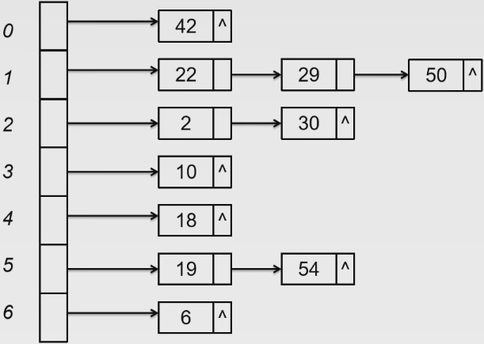

###### 哈希表查找时间复杂度

- 最理想情况下：哈希函数没有冲突，所有目标值只需1次哈希=>O(1)
- 一般情况下：取决于数据元素的分布，哈希函数的设计和冲突解决方法

#### key

1. 哈希函数是一个映射：元素值->哈希值
2. 不同的元素拥有相同的哈希值：冲突
3. 哈希函数应尽量能较为均匀地映射元素=>降低冲突概率
   - 设数据元素为{2,4,6,8,10,12...}，设计采用下列哪个哈希函数能使得该哈希表查找效率更高(B)
     A.h(x)=x%2 B. h(x)=x%7
     C.h(x)=x%4 D.查找效率与哈希函数无关
     - 分析：设计哈希函数应根据数据分布情况，尽量选择能将数据均匀映射的哈希函数以降低冲突概率，提高效率
       通常对于数字类数据，采用**对一素数取余**作为哈希函数
4. 冲突解决方法：①开放地址法 ②链地址法
   - 判断题：采用链地址法解决冲突能保证哈希表的查找时间复杂度为O(1)(×)
   - 设一哈希表使用哈希函数h(x)=x%7，采用链地址法解决冲突，写出依次往哈希表中插入22，6，19，18，2，29，30，42，10，54，50后的哈希表结构
     
   - 假设查找每个元素的概率相等，则此时在该哈希表上进行查找的平均查找次数为(16/11)
5. 线性探测法就是向后逐个位置试
   - 一哈希表采用哈希函数H(x)=X%5且使用线性探测法处理冲突，初始时表为空，连续往
     表内插入索引值为27和62的两个元素后，再插入元素17的哈希值为(4)
     - 分析：采用线性探测法，即哈希失败后向后逐个位置尝试，直至有空位。
     - 插入27：H(27)=2，没有冲突
     - 插入62：H(62)=2，发生冲突，向后探测次，放入3
     - 插入17：H(17)=2，发生冲突，向后探测1次，仍然冲突，再向后探测1次，放入4
   - 假设上表中查找各元素的概率相等，平均查找长度为(2)
     - 分析：查找长度即为插入时的哈希次数，等概率情况下，平均查找长度为(1+2+3)/3=2


## 排序

### 本章学习目标

1. 理解排序的稳定性和内部排序/外部排序的概念
2. 对以下6个算法，理解其**单步操作**，给定一个序列，能够写出单步操作后的结果：
   - 直接插入、选择、冒泡、归并、快排、基数排序
3. 知道快速排序和冒泡排序在序列满足哪种**初始形态**时效率较高/低
4. *知道什么是小顶堆/大顶堆
5. *理解记忆各种排序算法的时空复杂度

### 排序基本概念

- 排序：将—个序列变为有序:[7, 5, 3, 5, 11] => [3, 5, 5, 7, 11]
- **稳定**排序：排序值相同的元素排序后**不交换**位置

#### 内部排序和外部排序

- 内部排序：待排序元素可以全部读进内存，可以同时知晓全部元素信息
- 外部排序：待排序元素**无法全部读进内存**，无法同时获取所有元素信息
  - 需要在排序的同时不断读写**外存文件**(如硬盘)，以加载和暂存中间结果

### 重点排序算法(6个)

#### (直接)插入排序

- 将序列分为**已排序**部分(初始为首元素)和**未排序**部分
- 依次将未排序部分元素插入至已排序部分的正确位置上
- 时间复杂度O(n^2^)
- 空间复杂度O(1)

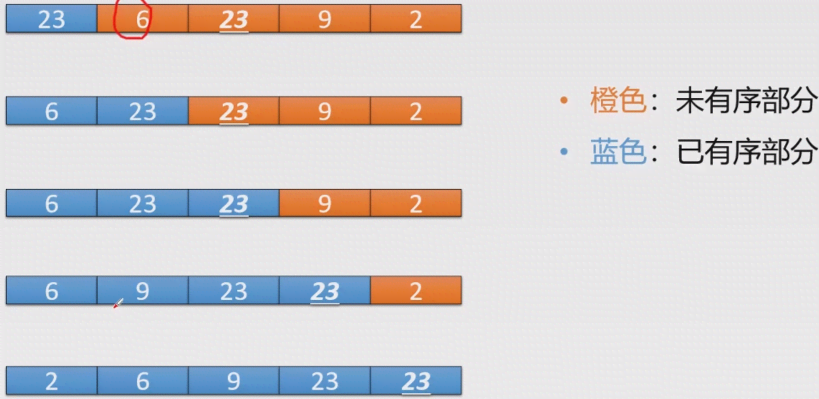

##### Key

1. 插入排序：逐个从未排序部分取元素，放入已排序部分的正确位置
2. 插入排序是稳定的：找的是已排序部分首个**大于**待插入元素的位置
   - 对序列(19，8，67，<u>19</u>，81，2，26)从小到大排序，请写出插入排序3趟之后的结果(8，19，<u>19</u>，67，81，2，26)
     - 分析：初始时，已排序部分只有首元素(不同教材/老师对此定义不同，亦有说初始时已排序部分为空，也即第1趟排序之后序列不变)
       - 初始：**19**，8，67，<u>19</u>，81，2，26
       - 第1趟：**8，19**，67，19，81，2，26
       - 第2趟：**8，19**，<u>19</u>，67，81，2，26
       - 第3趟：**8，19，<u>19</u>，67**，81，2，26

#### 选择排序

- 将序列分为**已排序**部分(初始为空)和**未排序**部分
- 依次从未排序部分挑选一个最小的(最大的)，将它添加到已完成部分的末尾
- 选择排序**不稳定**：因添加本趟元素时发生位置交换

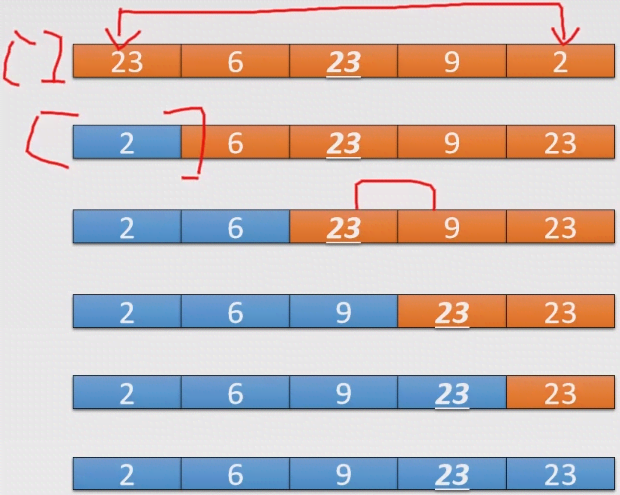

##### Key

1. 选择排序：从未排序部分选择最小元素，放入已排序部分的末尾
2. 选择排序不稳定：↑操作实际是将该元素与未排序部分首元素**交换**
   - 对序列(19，8，67，<u>19</u>，81，2，26)从小到大排序，请写出选择排序3趟之后的结果(2，8，<u>19</u>，67，81，19，26)
     - 分析：初始时，已排序部分为空。
       - 初始：19，8，67，<u>19</u>，81，2，26
       - 第1趟：**2**，8，67，<u>19</u>，81，19，26
       - 第2趟：**2，8**，67，<u>19</u>，81，19，26
       - 第3趟：**2，8，<u>19</u>**，67，81，2，26

#### 冒泡排序

- 每次让一个元素**“沉底"**
- 沉底：比较相邻元素，将逆序者交换位置，将大的元素逐步**“右移”**至已排序部分的最左端
- 本质是一种交换排序，通过交换逆序相邻元素逐步使序列有序
- 提前结束：一趟“沉底”中，没有发生交换
- 在序列初始已经较为有序的情况下，冒泡效率很高
- 在最坏情况下(初始倒序)，O(n^2^)
- 冒泡排序稳定：因相邻元素相等则无需交换
- 时间复杂度O(n^2^)
- 空间复杂度O(1)

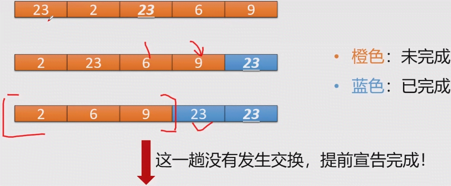

##### Key

1. 冒泡排序：通过交换相邻逆序元素逐步使序列有序
2. 冒泡排序是稳定的：如果相邻元素相等就无需交换
3. 一趟“沉底"若无交换发生，即完成排序
   - 对序列(2，4，1，5，3)从小到大进行冒泡排序，经过(C)趟”沉底”后排序完成
     A.7 B.5 C.3 D.2
     - 分析：初始时，已排序部分为空。
       - 初始：{2，4，1，5， 3}
       - 第1趟沉底：{2，1， 4，3，5} //注意4和1是交换了位置的
       - 第2趟沉底：{1，2，3，4，5} //注意这次沉底仍有元素交换发生，所以仍要再开始下一趟
       - 第3趟沉底：{1，2，3，4，5} //这一趟没有交换发生，我们知道已经完成

#### 2路-归并排序

- 从大到小，**划分**序列直至子序列长度为1，将其视为个有序子序列
- 从小到大，不断**合并**两个有序子序列，最终使得整个序列有序
- 冒泡排序稳定：因为合并两有序表不改变相同元素顺序
- 利用分治思想：时间复杂度O(n*lgn)
- 合并两个有序顺序表：空间复杂度O(n)

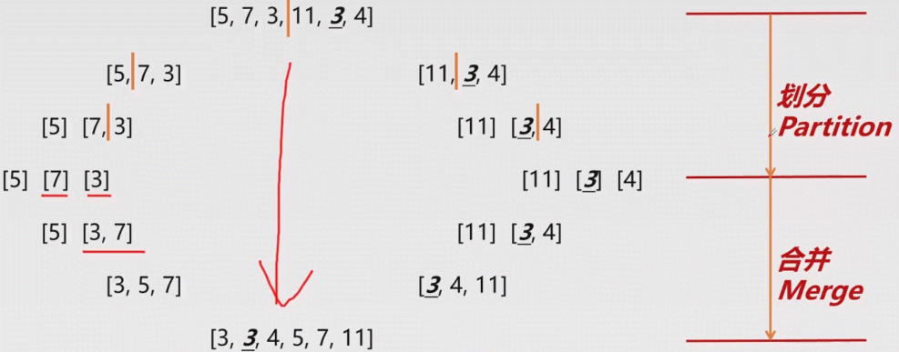

#### 快速排序

- 每趟确定一个元素的位置，左边的都比它小，右边都比它大，再依样递归分别处理左右
- 这个元素称为**基准**(pivot)，通常选当前子序列的首元素
- 快排也是交换排序，是不稳定的，交交换有可能改变相同元素次序
- 如果初始序列较为随机，快排是O(n*lgn)的
- 但若初始序列较为有序(无论逆序或正序)，快排退化为O(n^2^)
  - 因为每趟中pivot无法将序列划分为长度较相等的两部分
  - 相当于分治失效

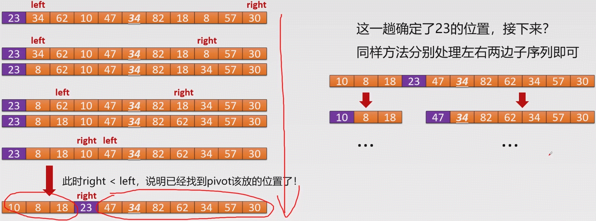

##### Key

1. 快速排序：每趟确定一个“基准”的位置，再同样处理其左右两边
2. 快速排序不稳定：元素会发生交换
   - 对下列序列35 44 67 23 15 44 39 32进行快速排序，每次划分以被划分区域内第一个元素作为基准元素，写出每次划分后得到的序列。
     - 分析：初始：35，44，67，23，15，<u>44</u>，39，32
       - 划分：23，32，15，**35**，67，<u>44</u>，39，44 //注意最后35是和23交换位置，完成落位
       - 再划分：15，**23**，32，**35**，44，<u>44</u>，39，**67** // 注意子序列44，<u>44</u>，39的落位细节
       - 再划分：**15**，**23**，**32**，**35**，39，**44**，<u>44</u>，**67**

#### *基数排序

- 基数排序：按照各位值进行**分配**-收集，无需比较元素值大小，是**桶式排序**

### 其他排序算法

#### 堆排序

- 如果一棵完全二叉树上每一个结点都比其左右孩子大，称之为大顶堆
- 如果一棵完全二叉树上每一个结点都比其左右孩子小，称之为下顶堆
- 根即tree[0]
- 交换tree[O]和tree[N-1]，然后将tree[0:N-1]重新调整为大顶堆，重复此过程，即可小->大排序

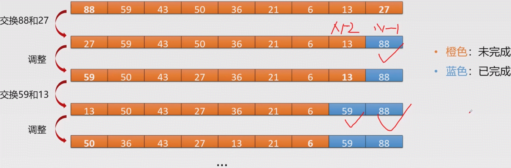
